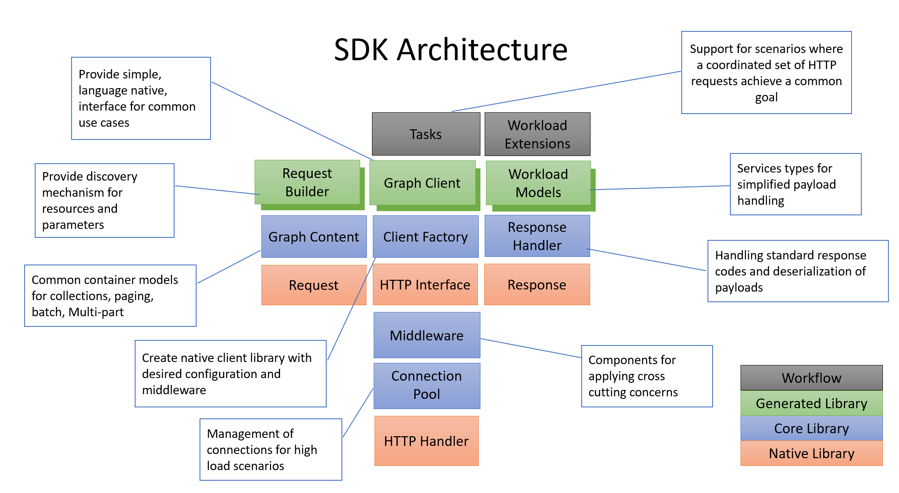

# Microsoft Graph SDKs - Requirements and Design

This repository holds documents related to current and on-going work on Microsoft Graph SDKs.  The following diagram shows a high level view of the SDK component architecture. The goal is to enable developers to opt-into functionality that they wish to use.  Over time all the SDKs will be adapted to follow this pattern.

## SDK Features Support

| Component |Feature| .net | Java | JS | Powershell | PHP | Ruby | Python | Go | TS |
|--|--|--|--|--|--|--|--|--|--|--|
|[Middleware](middleware/middleware.md)
| | Pipeline                |✓|✓|[✓][js_middleware]|✓| | |[✓][python_middleware]| [✓][go_middleware]|
| | [Authorization Handler](middleware/AuthorizationHandler.md)   | | |[✓][js_authhandler]| [✓][powershell_authhandler] | | | | | |
| | [Retry Handler](middleware/RetryHandler.md)              |[✓][dotnet_retryhandler]|[✓][java_retryhandler]|[✓][js_retryhandler]|[✓][dotnet_retryhandler]| | | [✓][python_retryhandler]| [✓][go_retryhandler]
| | [Redirect Handler](middleware/RedirectHandler.md)        |[✓][dotnet_redirecthandler]|[✓][java_redirecthandler]|[✓][js_redirecthandler]|[✓][dotnet_redirecthandler]| | |✓ | [✓][go_redirecthandler]|
| | [Request compression Handler](middleware/CompressionHandler.md) | | | | | | |
| | [Response decompression Handler](middleware/DecompressionHandler.md) |N|N|N|N| |
| | [Logging Handler](middleware/LoggingHandler.md) (PowerShell only since other languages implement Observability/OTEL ) | N/A | N/A | |[✓][powershell_logginghandler]| N/A | N/A | N/A | N/A | N/A |
| | [Telemetry Handler](middleware/TelemetryHandler.md) |[✓][dotnet_telemetryhandler]|[✓][java_telemetryhandler]|✓|[✓][powershell_telemetryhandler]| | |[✓][python_telemetryhandler] | [✓][go_telemetryhandler]|
| | [Connection Management](middleware/ConnectionPoolManager.md) | | | | | |
| | [Long Running Operations](middleware/LongRunningOperationHandler.md) | | | | | |
| | [Chaos Handler](middleware/ChaosHandler.md) | |[✓][java_chaoshandler] |O| | |
| | [Sunset Handler](middleware/SunsetHandler.md) | 
| | [Headers Inspection Handler](middleware/HeadersInspectionHandler.md) | [✓][dotnet_headersinspectionhandler] | [✓][java_headersinspectionhandler] | | | [✓][php_headersinspectionhandler] | | [✓][python_headersinspectionhandler] | [✓][go_headersinspectionhandler] | [✓][typescript_headersinspectionhandler] |
| | [Parameters Name Decoding Handler](middleware/ParametersNameDecodingHandler.md) | [✓][dotnet_paramhandler] | [✓][java_paramhandler] | | N/A | [✓][php_paramhandler] | [✓][ruby_paramhandler] | [✓][python_paramhandler] | [✓][go_paramhandler]
| | [Service Discovery Handler](middleware/ServiceDiscoveryHandler.md) | | | | | |
| [Content](content/ContentArchitecturalConstraints.md)
|| [Batch Request Content](content/BatchRequestContent.md)     |[✓][dotnet_batchrequestcontent]|[✓][java_batchrequestcontent]|[✓][js_batchrequestcontent]| | |
|| [Batch Response Content](content/BatchResponseContent.md)   |[✓][dotnet_batchresponsecontent]|[✓][java_batchresponsecontent]|[✓][js_batchresponsecontent] | | |
|| [Multipart Content](content/MultipartContent.md)            |✓|[✓][java_multipartcontent]| | | |
|| [Error Content](content/ErrorContent.md)            | | | |N| |
| Graph Components
|| [Client Factory](GraphClientFactory.md)           |[✓][dotnet_clientfactory]|[✓][java_httpclients]|[✓][js_graphclientfactory]|[✓][dotnet_clientfactory]| | |[✓][python_graphclientfactory] | [✓][go_graphclientfactory]
|| [Response Handling](ResponseHandler.md) |[✓][dotnet_responsehandler]| |[✓][js_responsehandler]|✓||
| Tasks
|| [File Upload](tasks/FileUploadTask.md)                | |[✓][java_largefileupload]|[✓][js_fileuploadtask] |[✓][powershell_fileupload] | |
|| [Page Iterator](tasks/PageIteratorTask.md)            |[✓][dotnet_pageiteratortask]||[✓][js_pageiteratortask] |[✓][powershell_pageiterator]| |
| [Providers](providers/providers.md)
|| [Authentication](providers/AuthenticationProvider.md)              |[✓][dotnet_authprovider]|[✓][java_authprovider]|[✓][js_authprovider]|[✓][powershell_authprovider]| | | | [✓][go_authprovider]|
|| [Logging](providers/LoggingProvider.md)                     | | | |N| |

✓ - Completed  
O - In progress
N - Native library support

> NOTE: additionally all handler should provide observability and tracing support through Open Telemetry. [More information](./Observability.md)

## Supported Languages

### .NET

|Role| Repo | Packages |
|--|--|--|
|Service+Models|[msgraph-sdk-dotnet](https://github.com/microsoftgraph/msgraph-sdk-dotnet)|[Nuget](https://www.nuget.org/packages/Microsoft.Graph/)|
|Core|[msgraph-sdk-dotnet-core](https://github.com/microsoftgraph/msgraph-sdk-dotnet-core)|[Nuget](https://www.nuget.org/packages/Microsoft.Graph.Core/)|
|Auth|[Azure Identity](https://github.com/Azure/azure-sdk-for-net/tree/main/sdk/identity/Azure.Identity)|[Nuget](https://www.nuget.org/packages/Azure.Identity/)|
|Beta|[msgraph-beta-sdk-dotnet](https://github.com/microsoftgraph/msgraph-beta-sdk-dotnet)|[Nuget](https://www.nuget.org/packages/Microsoft.Graph.Beta/)|

### Go

|Role| Repo | Packages |
|--|--|--|
|Service+Models|[msgraph-sdk-go](https://github.com/microsoftgraph/msgraph-sdk-go)|[pkg.go.dev](https://pkg.go.dev/github.com/microsoftgraph/msgraph-sdk-go/)|
|Core|[msgraph-sdk-go-core](https://github.com/microsoftgraph/msgraph-sdk-go-core)|[pkg.go.dev](https://pkg.go.dev/github.com/microsoftgraph/msgraph-sdk-go-core/)|
|Auth|[azure-identity](https://github.com/Azure/azure-sdk-for-go/tree/main/sdk/azidentity)|[pkg.go.dev](https://pkg.go.dev/github.com/Azure/azure-sdk-for-go/sdk/azidentity)|
|beta|[msgraph-beta-sdk-go](https://github.com/microsoftgraph/msgraph-beta-sdk-go)|[pkg.go.dev](https://pkg.go.dev/github.com/microsoftgraph/msgraph-beta-sdk-go/)|

### Javascript

|Role| Repo | Packages |
|--|--|--|
|Service+Core|[msgraph-sdk-javascript](https://github.com/microsoftgraph/msgraph-sdk-javascript)||
|Models|[msgraph-typescript-typings](https://github.com/microsoftgraph/msgraph-typescript-typings)||

### Java

|Role| Repo | Packages |
|--|--|--|
|Service+Models|[msgraph-sdk-java](https://github.com/microsoftgraph/msgraph-sdk-java)|[Maven Central](https://mvnrepository.com/artifact/com.microsoft.graph/microsoft-graph)|
|Core|[msgraph-sdk-java-core](https://github.com/microsoftgraph/msgraph-sdk-java-core)|[Maven Central](https://mvnrepository.com/artifact/com.microsoft.graph/microsoft-graph-core)|
|Auth|[azure-identity](https://github.com/Azure/azure-sdk-for-java/tree/main/sdk/identity/azure-identity)|[Maven Central](https://mvnrepository.com/artifact/com.azure/azure-identity)|
|beta|[msgraph-beta-sdk-java](https://github.com/microsoftgraph/msgraph-beta-sdk-java)|[Maven Central](https://mvnrepository.com/artifact/com.microsoft.graph/microsoft-graph-beta)|

Java Core is based on the [OkHttp](https://github.com/square/okhttp).

### PHP

|Role| Repo | Packages |
|--|--|--|
|Service+Models|[msgraph-sdk-php](https://github.com/microsoftgraph/msgraph-sdk-php)||
|Core|[msgraph-sdk-php-core](https://github.com/microsoftgraph/msgraph-sdk-php-core)||
|beta|[msgraph-sdk-php-beta](https://github.com/microsoftgraph/msgraph-beta-sdk-php)||

### Ruby

|Role| Repo | Packages |
|--|--|--|
|All|[msgraph-sdk-ruby](https://github.com/microsoftgraph/msgraph-sdk-ruby)|

### Python

|Role| Repo | Packages |
|--|--|--|
|Service+Models|[msgraph-sdk-python](https://github.com/microsoftgraph/msgraph-sdk-python)|[PyPI](https://pypi.org/project/msgraph-sdk/)|
|Core|[msgraph-sdk-python-core](https://github.com/microsoftgraph/msgraph-sdk-python-core)|[PyPI](https://pypi.org/project/msgraph-core/)|
|beta|[msgraph-beta-sdk-python](https://github.com/microsoftgraph/msgraph-beta-sdk-python)|[PyPI](https://pypi.org/project/msgraph-beta-sdk/)|

## Issues

View or log issues on the [Issues](https://github.com/microsoftgraph/msgraph-sdk-design/issues) tab in the repo.

## Copyright and license

Copyright (c) Microsoft Corporation. All Rights Reserved. Licensed under the MIT [license](LICENSE).

This project has adopted the [Microsoft Open Source Code of Conduct](https://opensource.microsoft.com/codeofconduct/). For more information see the [Code of Conduct FAQ](https://opensource.microsoft.com/codeofconduct/faq/) or contact [opencode@microsoft.com](mailto:opencode@microsoft.com) with any additional questions or comments.

[java_authprovider]: https://github.com/Azure/azure-sdk-for-java/tree/main/sdk/identity/azure-identity
[java_chaoshandler]: https://github.com/microsoft/kiota-java/blob/main/components/http/okHttp/src/main/java/com/microsoft/kiota/http/middleware/ChaosHandler.java
[java_redirecthandler]: https://github.com/microsoft/kiota-java/blob/main/components/http/okHttp/src/main/java/com/microsoft/kiota/http/middleware/RedirectHandler.java
[java_retryhandler]: https://github.com/microsoft/kiota-java/blob/main/components/http/okHttp/src/main/java/com/microsoft/kiota/http/middleware/RetryHandler.java
[java_telemetryhandler]: https://github.com/microsoft/kiota-java/blob/main/components/http/okHttp/src/main/java/com/microsoft/kiota/http/middleware/TelemetryHandler.java
[java_batchrequestcontent]: https://github.com/microsoftgraph/msgraph-sdk-java-core/blob/main/src/main/java/com/microsoft/graph/core/content/BatchRequestContent.java
[java_batchresponsecontent]: https://github.com/microsoftgraph/msgraph-sdk-java-core/blob/main/src/main/java/com/microsoft/graph/core/content/BatchResponseContent.java
[java_multipartcontent]: https://github.com/microsoft/kiota-java/blob/main/components/abstractions/src/main/java/com/microsoft/kiota/MultipartBody.java
[java_largefileupload]: https://github.com/microsoftgraph/msgraph-sdk-java-core/blob/main/src/main/java/com/microsoft/graph/core/tasks/LargeFileUploadTask.java
[java_httpclients]: https://github.com/microsoftgraph/msgraph-sdk-java-core/blob/dev/src/main/java/com/microsoft/graph/httpcore/HttpClients.java
[java_paramhandler]: https://github.com/microsoft/kiota-java/blob/main/components/http/okHttp/src/main/java/com/microsoft/kiota/http/middleware/ParametersNameDecodingHandler.java
[java_headersinspectionhandler]: https://github.com/microsoft/kiota-java/blob/main/components/http/okHttp/src/main/java/com/microsoft/kiota/http/middleware/HeadersInspectionHandler.java

[dotnet_authprovider]: https://github.com/Azure/azure-sdk-for-net/tree/main/sdk/identity/Azure.Identity
[dotnet_retryhandler]: https://github.com/microsoft/kiota-dotnet/blob/main/src/http/httpClient/Middleware/RetryHandler.cs
[dotnet_redirecthandler]: https://github.com/microsoft/kiota-dotnet/blob/main/src/http/httpClient/Middleware/RedirectHandler.cs
[dotnet_clientfactory]: https://github.com/microsoftgraph/msgraph-sdk-dotnet-core/blob/main/src/Microsoft.Graph.Core/Requests/GraphClientFactory.cs
[dotnet_batchrequestcontent]: https://github.com/microsoftgraph/msgraph-sdk-dotnet-core/blob/main/src/Microsoft.Graph.Core/Requests/Content/BatchRequestContent.cs
[dotnet_batchresponsecontent]: https://github.com/microsoftgraph/msgraph-sdk-dotnet-core/blob/main/src/Microsoft.Graph.Core/Requests/Content/BatchResponseContent.cs
[dotnet_responsehandler]: https://github.com/microsoftgraph/msgraph-sdk-dotnet-core/blob/main/src/Microsoft.Graph.Core/Requests/ResponseHandler.cs
[dotnet_pageiteratortask]: https://github.com/microsoftgraph/msgraph-sdk-dotnet-core/blob/main/src/Microsoft.Graph.Core/Tasks/PageIterator.cs
[dotnet_telemetryhandler]: https://github.com/microsoftgraph/msgraph-sdk-dotnet-core/blob/main/src/Microsoft.Graph.Core/Requests/GraphClientFactory.cs
[dotnet_paramhandler]: https://github.com/microsoft/kiota-dotnet/blob/main/src/http/httpClient/Middleware/ParametersNameDecodingHandler.cs
[dotnet_headersinspectionhandler]: https://github.com/microsoft/kiota-dotnet/blob/main/src/http/httpClient/Middleware/HeadersInspectionHandler.cs

[js_middleware]: https://github.com/microsoftgraph/msgraph-sdk-javascript/blob/dev/src/middleware/IMiddleware.ts
[js_authhandler]: https://github.com/microsoftgraph/msgraph-sdk-javascript/blob/dev/src/middleware/AuthenticationHandler.ts
[js_responsehandler]: https://github.com/microsoftgraph/msgraph-sdk-javascript/blob/dev/src/GraphResponseHandler.ts
[js_batchrequestcontent]: https://github.com/microsoftgraph/msgraph-sdk-javascript/blob/dev/src/content/BatchRequestContent.ts
[js_batchresponsecontent]: https://github.com/microsoftgraph/msgraph-sdk-javascript/blob/dev/src/content/BatchResponseContent.ts
[js_fileuploadtask]: https://github.com/microsoftgraph/msgraph-sdk-javascript/blob/dev/src/tasks/LargeFileUploadTask.ts
[js_pageiteratortask]: https://github.com/microsoftgraph/msgraph-sdk-javascript/blob/dev/src/tasks/PageIterator.ts
[js_redirecthandler]: https://github.com/microsoftgraph/msgraph-sdk-javascript/blob/dev/src/middleware/RedirectHandler.ts
[js_retryhandler]: https://github.com/microsoftgraph/msgraph-sdk-javascript/blob/dev/src/middleware/RetryHandler.ts
[js_graphclientfactory]: https://github.com/microsoftgraph/msgraph-sdk-javascript/blob/dev/src/HTTPClientFactory.ts
[js_authprovider]: https://github.com/microsoftgraph/msgraph-sdk-javascript/blob/dev/src/MSALAuthenticationProvider.ts

[python_middleware]: https://github.com/microsoftgraph/msgraph-sdk-python-core/blob/dev/msgraph/core/middleware/middleware.py
[python_retryhandler]: https://github.com/microsoftgraph/msgraph-sdk-python-core/blob/dev/msgraph/core/middleware/retry.py
[python_graphclientfactory]: https://github.com/microsoftgraph/msgraph-sdk-python-core/blob/dev/msgraph/core/_client_factory.py
[python_telemetryhandler]: https://github.com/microsoftgraph/msgraph-sdk-python-core/blob/dev/msgraph/core/middleware/telemetry.py
[python_paramhandler]: https://github.com/microsoft/kiota-http-python/blob/main/kiota_http/middleware/parameters_name_decoding_handler.py
[python_headersinspectionhandler]: https://github.com/microsoft/kiota-http-python/blob/main/kiota_http/middleware/headers_inspection_handler.py

[go_middleware]: https://github.com/microsoft/kiota-http-go/blob/main/pipeline.go
[go_authprovider]: https://github.com/microsoft/kiota-authentication-azure-go
[go_retryhandler]: https://github.com/microsoft/kiota-http-go/blob/main/retry_handler.go
[go_redirecthandler]: https://github.com/microsoft/kiota-http-go/blob/main/redirect_handler.go
[go_graphclientfactory]: https://github.com/microsoftgraph/msgraph-sdk-go-core/blob/main/graph_client_factory.go
[go_telemetryhandler]: https://github.com/microsoftgraph/msgraph-sdk-go-core/blob/main/graph_telemetry_handler.go
[go_paramhandler]: https://github.com/microsoft/kiota-http-go/blob/main/parameters_name_decoding_handler.go
[go_headersinspectionhandler]: https://github.com/microsoft/kiota-http-go/blob/main/headers_inspection_handler.go

[powershell_telemetryhandler]: https://github.com/microsoftgraph/msgraph-sdk-powershell/blob/dev/src/Authentication/Authentication/Helpers/HttpHelpers.cs
[powershell_logginghandler]: https://github.com/microsoftgraph/msgraph-sdk-powershell/blob/dev/tools/Custom/Module.cs
[powershell_fileupload]: https://github.com/microsoftgraph/msgraph-sdk-powershell/blob/dev/tools/Custom/FileUploadCmdlet.cs
[powershell_pageiterator]: https://github.com/microsoftgraph/msgraph-sdk-powershell/blob/dev/tools/Custom/ListCmdlet.cs
[powershell_authprovider]: https://github.com/microsoftgraph/msgraph-sdk-powershell/blob/dev/src/Authentication/Authentication/Cmdlets/ConnectMgGraph.cs
[powershell_authhandler]: https://github.com/microsoftgraph/msgraph-sdk-powershell/blob/dev/src/Authentication/Authentication/Cmdlets/InvokeMgGraphRequest.cs

[php_paramhandler]: https://github.com/microsoft/kiota-http-guzzle-php/blob/dev/src/Middleware/ParametersNameDecodingHandler.php
[php_headersinspectionhandler]: https://github.com/microsoft/kiota-http-guzzle-php/blob/dev/src/Middleware/HeadersInspectionHandler.php

[ruby_paramhandler]: https://github.com/microsoft/kiota-http-ruby/blob/main/lib/microsoft_kiota_faraday/middleware/parameters_name_decoding_handler.rb

[typescript_headersinspectionhandler]: https://github.com/microsoft/kiota-typescript/blob/main/packages/http/fetch/src/middlewares/headersInspectionHandler.ts
